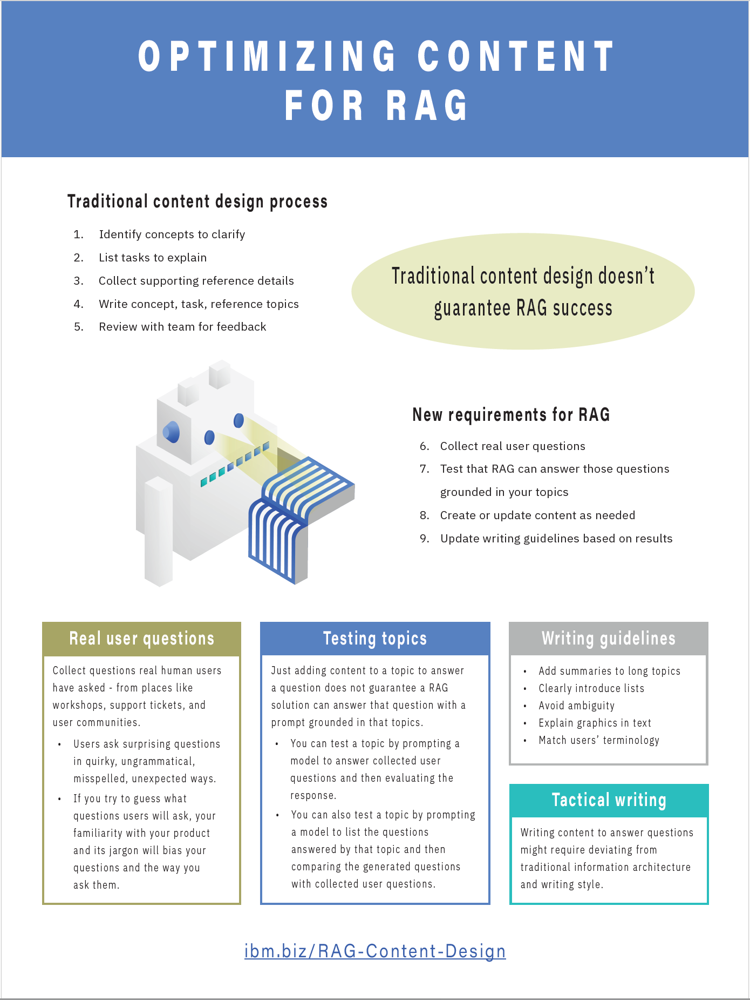
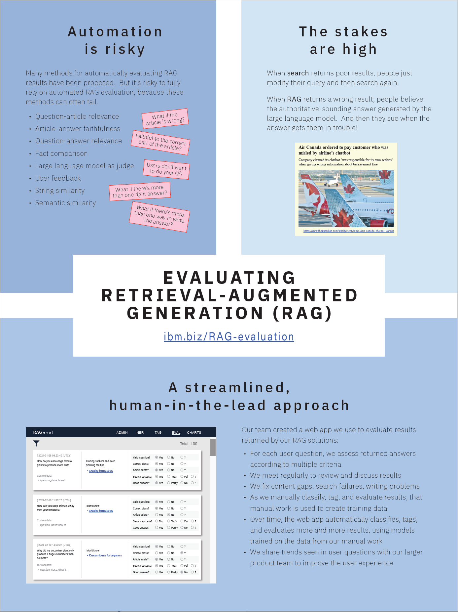

# RAG: A Content Design Perspective
The posters below were presented at [CASCON](https://cascon.ca) 2024.

*For more information about the ideas presented in these posters, see: 
[Optimizing and Evaluating Enterprise Retrieval-Augmented Generation (RAG): A Content Design Perspective](https://github.com/spackows/ICAAI-2024_RAG-CD/tree/main)*

&nbsp;

<table>
<tr>
<th>Poster</th>
<th>Description</th>
</tr>
<tr>
<td valign="top">

Optimizing&nbsp;content&nbsp;for&nbsp;RAG

</td>
<td valign="top">

This poster describes how content teams must adapt their processes in the era of RAG: adopt question-driven content development.

<i>Special thanks:</i>

<ul>
<li>Design concept: Chloe Maceda (<mailto>chloe.maceda@ibm.com</mailto>)</li>
<li>Robot graphic: Malik Johnson (<mailto>Malik.Johnson@ibm.com</mailto>)</li>
</ul>

Download: <a href="posters/optimizing-content_CASCON-2024.pdf">Poster</a>

</td>
</tr>
<tr>
<td valign="top">

Evaluating&nbsp;RAG

</td>
<td valign="top">

This poster describes why it is risky to rely on only automated evaluation of RAG solutions, and proposes a human-in-the-lead approach to RAG evaluation.

Download: <a href="posters/RAG-evaluation_CASCON-2024.pdf">Poster</a>

</td>
</tr>
</table>

&nbsp;

